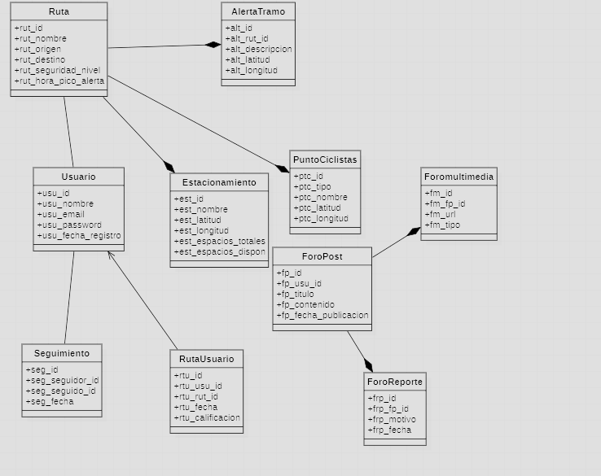
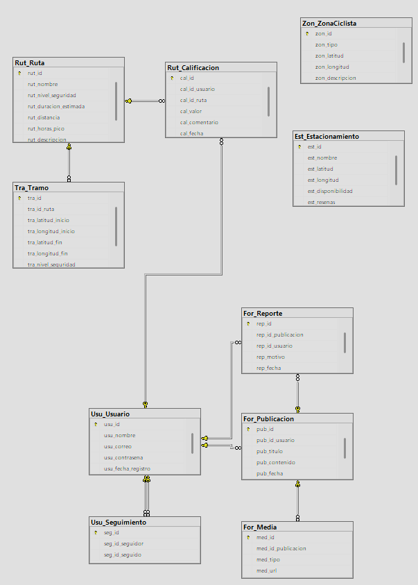

# 4.2. Information Architecture
### 4.2.1. Organization Systems

La interfaz muestra una organización jerárquica clara

- En la primera pantalla, el enfoque está completamente centrado en el inicio de sesión, presentándolo como el primer paso esencial para acceder a la aplicación.

- En la segunda pantalla , se utiliza una organización secuencial donde el usuario primero debe seleccionar su ruta a través del campo “Ingresa destino”, seguido por la visualización del mapa y los filtros disponibles. 

### 4.2.2. Labeling Systems

- Arriba en la segunda pantalla, el encabezado “Selecciona tu ruta” resume claramente el propósito actual de la vista.

- Los botones en el lado derecho tienen etiquetas concisas como: “Filtros”, “seguridad”, “tiempo”, “recomendaciones”, y “rutas guardadas”, que indican de forma clara las funciones disponibles para el usuario.

- La barra de navegación lateral se representa con un icono de tras rayas, lo cual es común para agrupar funciones o secciones.

### 4.2.3. SEO Tags and Meta Tags

Se utilizaran etiquetas meta para optimizar el posicionamiento y el contenido del sitio web. Estas etiquetas permitirán mejorar el análisis de los motores de búsqueda y la estructuración del sitio.

```html
<title>Register your processes with CicloVia</title>
<meta charset="utf-8">
<meta name="description" content="CicloVia is a web application focused on cycling."/>
<meta name="author" content="CicloVia"/>
<meta name="copyright" content="Copyright CicloVia team" />
```
### 4.2.4. Searching Systems

- El campo “Ingresa destino” permite a los usuarios buscar rutas específicas, representando el sistema de búsqueda principal de la pantalla.

- Esto facilita tanto a conductores como a pasajeros encontrar coincidencias según su ubicación y preferencias.

### 4.2.5. Navigation Systems

- El menú superior contiene un botón de regreso, ayudando a mantener una navegación fluida.

- La barra lateral sirve para acceder a otras secciones como perfil, historial, etc.

- El desplazamiento dentro del mapa y los filtros por categorías permiten una navegación detallada dentro de esta vista sin saturar la interfaz.


 
## 4.7. Software Object-Oriented Design
Una vista preeliminar a cómo deberían estar estructuradas las clases del proyecto.

### 4.7.1 Class Diadrams 



### 4.7.2 Class Dictionary

 # Usuario
| Atributo              | Tipo de Dato | Descripción |
|-----------------------|--------------|-------------|
| usu_id                | INT          | Identificador único del usuario. |
| usu_nombre            | VARCHAR      | Nombre completo del usuario. |
| usu_email             | VARCHAR      | Correo electrónico del usuario. |
| usu_password          | VARCHAR      | Contraseña encriptada del usuario. |
| usu_fecha_registro    | DATE         | Fecha de registro en la plataforma. |

---

#  Ruta
| Atributo              | Tipo de Dato | Descripción |
|-----------------------|--------------|-------------|
| rut_id                | INT          | Identificador único de la ruta. |
| rut_nombre            | VARCHAR      | Nombre descriptivo de la ruta. |
| rut_origen            | VARCHAR      | Punto de origen de la ruta. |
| rut_destino           | VARCHAR      | Punto final de la ruta. |
| rut_seguridad_nivel   | INT          | Nivel de seguridad (1 a 5). |
| rut_hora_pico_alerta  | BOOLEAN      | Indica si la ruta tiene tramos de alta congestión. |

---

# AlertaTramo
| Atributo              | Tipo de Dato | Descripción |
|-----------------------|--------------|-------------|
| alt_id                | INT          | Identificador único de la alerta. |
| alt_rut_id            | INT (FK)     | Ruta asociada. |
| alt_descripcion       | TEXT         | Descripción del tramo inseguro. |
| alt_latitud           | DECIMAL      | Latitud del tramo. |
| alt_longitud          | DECIMAL      | Longitud del tramo. |

---

# RutaUsuario
| Atributo              | Tipo de Dato | Descripción |
|-----------------------|--------------|-------------|
| rtu_id                | INT          | Identificador único del registro. |
| rtu_usu_id            | INT (FK)     | Usuario que eligió la ruta. |
| rtu_rut_id            | INT (FK)     | Ruta seleccionada. |
| rtu_fecha             | DATETIME     | Fecha y hora del recorrido. |
| rtu_calificacion      | INT          | Calificación de la ruta por el usuario. |

---

# Estacionamiento
| Atributo              | Tipo de Dato | Descripción |
|-----------------------|--------------|-------------|
| est_id                | INT          | Identificador único del estacionamiento. |
| est_nombre            | VARCHAR      | Nombre del estacionamiento. |
| est_latitud           | DECIMAL      | Latitud. |
| est_longitud          | DECIMAL      | Longitud. |
| est_espacios_totales  | INT          | Capacidad total. |
| est_espacios_dispon   | INT          | Espacios disponibles. |

---

# PuntoCiclista
| Atributo              | Tipo de Dato | Descripción |
|-----------------------|--------------|-------------|
| pct_id                | INT          | Identificador único. |
| pct_tipo              | VARCHAR      | Tipo (repuestos, mantenimiento, etc.). |
| pct_nombre            | VARCHAR      | Nombre del lugar. |
| pct_latitud           | DECIMAL      | Latitud. |
| pct_longitud          | DECIMAL      | Longitud. |

---

# ForoPost
| Atributo              | Tipo de Dato | Descripción |
|-----------------------|--------------|-------------|
| fp_id                 | INT          | ID del post. |
| fp_usu_id             | INT (FK)     | Usuario que publicó. |
| fp_titulo             | VARCHAR      | Título del post. |
| fp_contenido          | TEXT         | Contenido del post. |
| fp_fecha_publicacion  | DATETIME     | Fecha de publicación. |

---

# ForoMultimedia
| Atributo              | Tipo de Dato | Descripción |
|-----------------------|--------------|-------------|
| fm_id                 | INT          | ID del archivo multimedia. |
| fm_fp_id              | INT (FK)     | Post relacionado. |
| fm_url                | TEXT         | URL del archivo (imagen/video). |
| fm_tipo               | VARCHAR      | Tipo de archivo (imagen, video). |

---

# ForoReporte
| Atributo              | Tipo de Dato | Descripción |
|-----------------------|--------------|-------------|
| frp_id                | INT          | ID del reporte. |
| frp_fp_id             | INT (FK)     | Post reportado. |
| frp_usu_id            | INT (FK)     | Usuario que reporta. |
| frp_motivo            | TEXT         | Motivo del reporte. |
| frp_fecha             | DATETIME     | Fecha del reporte. |

---

# Seguimiento
| Atributo              | Tipo de Dato | Descripción |
|-----------------------|--------------|-------------|
| seg_id                | INT          | ID de seguimiento. |
| seg_seguidor_id       | INT (FK)     | Usuario que sigue. |
| seg_seguido_id        | INT (FK)     | Usuario seguido. |
| seg_fecha             | DATETIME     | Fecha de inicio del seguimiento. |
---

## 4.8 Database Desing
El diseño inicial a utilizar en la base de datos se hizo para que tuviera coherencia con el diagrama de clases. Nos permitirá un manejo más eficiente de los datos a utilizar.


