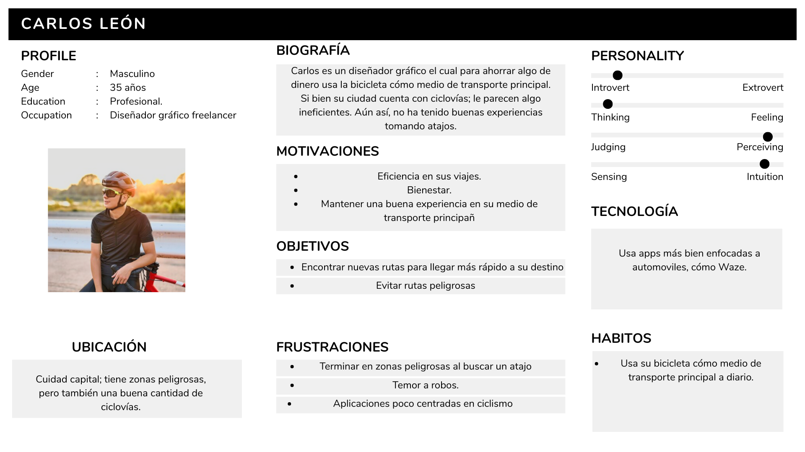
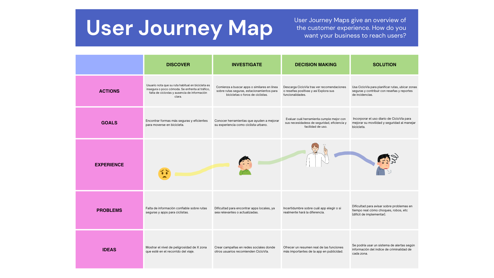
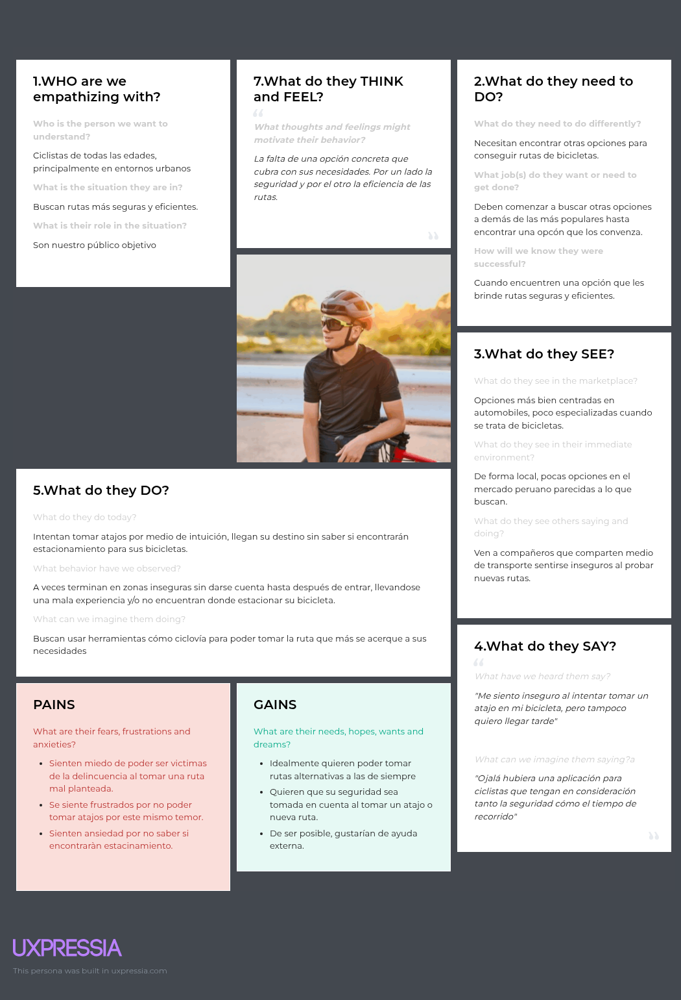

# 1.1. Startup Profile
### 1.1.1.Descripcion de la startup
Nuestra Startup llamado CicloVía, busca enfocarse en personas que se apasionen por el ciclismo. A veces es difícil encontrar rutas óptimas o lugares seguros para poder practicar este deporte, además de que a algunas personas le resulta difícil encontrar gente con su mismo gusto por el ciclismo. Es por ello, que estamos desarrollando un sistema que le permita a estas personas poder encontrar las rutas mas óptimas y seguras para poder seguir practicando de manera eficiente. Gracias a las diversas opciones de la aplicación, podrán visualizar foros, conocer otros ciclistas, encontrar lugares seguros, rutas seguras, etc.

##### Misión: Ayudar y revolucionar al deporte de ciclismo proporcionando un sistema de solución eficaz a los problemas.
##### Visión: Ser la principal aplicación de ayuda a los ciclistas.
### 1.1.2. Perfil de los integrantes

- Mi nombre es Juan Quijano, tengo 20 años y soy un estudiante de la carrera de Ingeniería de Software. Tengo conocimientos intermedios en programación y quisiera dedicarme eventualmente al desarrollo y uso de IA.
  
.jpg)
-----------------------------------------------------------------------------------------
- Mi nombre es Santiago Gordillo Ramos soy estudiante de ingeniería de software, tengo 21 años. Me gusta el lenguaje python y tengo conocimiento intermedio en los demás lenguajes.

-----------------------------------------------------------------------------------------
- Mi nombre es Melina Liz Santillan Alvarado y tengo 21 años. Estoy en la carrera de Ingeniería de Software. Soy una persona responsable y creativa, además soy buena trabajando en equipo. Por otro lado, tengo conocimientos en diferentes lenguajes de programación y frameworks.
  

-----------------------------------------------------------------------------------------
- Mi nombre es Jhon Rony Huamani Aguilar. Estudiante de Ingeniería de Software. Tengo mas conocimientos para el area de front-end pero me gustaria especializarme en back end en el futuro.

# 1.2. Solution Profile
### 1.2.1.Antecedentes y problemática
### What (Qué)  
**¿Cuál es el problema?**  
El problema radica en la falta de plataformas especializadas que faciliten a los ciclistas urbanos de Lima encontrar rutas seguras, óptimas y amigables para el ciclismo. A pesar de que el uso de la bicicleta ha crecido como medio alternativo y sostenible, los ciclistas enfrentan obstáculos como inseguridad vial, falta de infraestructura ciclista y la dificultad para encontrar comunidad o compañía al momento de practicar este deporte o trasladarse por la ciudad.  
La desconexión entre rutas ciclistas, el tráfico agresivo y la poca señalización para ciclistas agravan la situación, desincentivando su uso y exponiéndolos a riesgos innecesarios. 

### Where (Dónde)  
**¿A dónde se dirige?**  
El servicio está pensado para implementarse inicialmente en Lima , una ciudad caracterizada por su denso tráfico y escasa infraestructura para ciclistas. Nuestra meta es proporcionar a los usuarios de **CicloVía** una herramienta útil en los distritos más representativos y con potencial para el ciclismo urbano, expandiéndose posteriormente al resto de la ciudad y otras regiones del país.

### Why (Por Qué)  
**¿Cuál es la causa del problema?**  
Hay muchas causas,  la falta de planificación urbana para ciclistas, la inseguridad en las vías, la ausencia de rutas oficiales bien señalizadas y la falta de una comunidad tecnológica que integre herramientas sociales con funcionalidades prácticas para quienes aman el ciclismo urbano.

### When (Cuándo)  
**¿Cuándo sucede el problema?**  
Este problema se presenta todos los días, especialmente en horas punta. La necesidad se hace más evidente durante las mañanas, cuando los usuarios se dirigen a sus centros de estudio o trabajo, y por las tardes-noches, cuando regresan a casa. También se extiende a los fines de semana.

### Who (Quién)  
**¿Quiénes están involucrados? ¿Quién lo utilizará?**  
Los principales usuarios serán ciclistas urbanos, tanto aficionados como intermedios, que usan la bicicleta como medio de transporte, recreación o entrenamiento.

### How (Cómo)  
**¿Cómo se utilizará el producto?**  
**CicloVía** será una aplicación móvil y plataforma web que permitirá a los ciclistas:
- Encontrar rutas seguras, compartidas.
- Conocer el estado de las rutas en tiempo real (tráfico, peligros, eventos).
- Unirse a foros y comunidades de ciclismo.
- Planificar trayectos con anticipación.
- Conectarse con otros usuarios para salidas grupales.
- Compartir reseñas, alertas y recomendaciones.

### How Much (Cuánto)  
**¿Cuál es la magnitud del problema?**  
En Lima, más de 2 millones de personas utilizan bicicleta ocasionalmente o con regularidad (MTPE, 2023). Sin embargo, según la Municipalidad de Lima, solo ciertos sectores de las vías cuentan con infraestructura segura para ciclistas. A esto se suma el aumento de accidentes de tránsito que involucran ciclistas (Policía Nacional del Perú, 2022), además del crecimiento del uso de bicicleta como medio de transporte tras la pandemia.  
Por otro lado, la necesidad de encontrar comunidad también es un aspecto poco abordado tecnológicamente. **CicloVía** busca atender esta problemática real con una solución que mejore la seguridad, experiencia y conectividad entre ciclistas.

### 1.2.2. Lean UX Process
##### 1.2.2.1. Lean UX Problem Statements 
**Problem Statement**
En la ciudad de Lima, donde el tráfico vehicular, la contaminación y la inseguridad son parte del día a día, cada vez más personas optan por la bicicleta como medio de transporte alternativo. Sin embargo, se enfrentan a varios obstáculos: falta de infraestructura adecuada, escasas rutas seguras, y ausencia de herramientas digitales que integren comunidad, seguridad y planificación de recorridos urbanos en bicicleta.

**CicloVía** surge como una solución a estas problemáticas. Es una plataforma web diseñada específicamente para **ciclistas urbanos** que buscan movilizarse de forma segura, eficiente y económica en Lima. La aplicación permitirá planificar rutas seguras, formar grupos de viaje con personas de rutas similares, acceder a alertas de riesgo en tiempo real y recibir beneficios por el uso constante de la bicicleta.

Al conectar a ciclistas en una red colaborativa y brindar información precisa, CicloVía no solo promueve un transporte más sostenible, sino que también fortalece la comunidad ciclista y contribuye a una ciudad más saludable.

##### 1.2.2.2. Lean UX Assumptions
##### Business Assumptions
1. **Asumimos que nuestros usuarios** están optando por la bicicleta como medio de transporte diario debido al alto peligro del transporte público, el tráfico excesivo y el deseo de un estilo de vida más saludable.
2. **Estas necesidades seran abordadas** mediante el desarrollo del software dedicado al deporte del ciclismo prorizando la seguridad, eficiencia y comodidad del usuario.
3. **Los primeros usuarios serán** personas entre 18 y 35 años, aficionados al ciclismo urbano, que ya poseen una bicicleta y desean optimizar su experiencia de transporte diario.
4. **El valor principal que esperan de nuestra aplicación es poder**planificar rutas seguras, compartir su trayecto con otros ciclistas y mantenerse informados sobre zonas de alto riesgo o congestión.
5. **Los clientes obtendrán** recompensas por uso frecuente, retos mensuales, descuentos en tiendas de ciclismo asociadas.
6. **Planeamos atraer usuarios a través de** redes sociales, influencers ciclistas, alianzas con colectivos de ciclismo urbano.
7. **Generaremos ingresos en** funciones premium por suscripción (como alertas personalizadas o estadísticas de rendimiento), publicidad responsable dentro de la app, y alianzas con negocios del ecosistema ciclista (tiendas, mecánicas, cafés).
8. **Nuestra competencia incluye** aplicaciones como Google Maps o Strava, pero ninguna está diseñada específicamente para ciclistas.
9. **Creemos que nuestra ventaja competitiva radica en** el enfoque local, la red de rutas personalizadas, y las funcionalidades comunitarias como la creación de grupos de viaje o el sistema de alertas colaborativas.
10. **El mayor riesgo es** la falta de adopción tecnológica por parte de ciclistas que ya tienen rutas establecidas o que no consideran útil una app para sus recorridos. También podría haber desconfianza inicial hacia la plataforma.
11. **Enfrentaremos estos riesgos a través de** pruebas gratuitas, testimonios de usuarios reales y recompensas inmediatas por los primeros usos. También nos apoyaremos en colectivos ciclistas.

##### User Assumptions

**¿Quién es el usuario?**
Los usuarios de **CicloVía** son principalmente jóvenes y adultos que practican ciclismo urbano o recreativo. Se trata de personas que utilizan la bicicleta como medio de transporte, deporte o estilo de vida saludable. Nuestro enfoque inicial será Lima Metropolitana, con miras a expandirnos a otras regiones del país en función de la adopción del servicio.

**¿Qué problemas enfrenta nuestro producto? ¿Cómo los resolveremos?**
Uno de los principales desafíos es incentivar el uso continuo de la aplicación. Además, debemos asegurar que la información sobre rutas seguras esté siempre actualizada y sea confiable. Resolveremos esto mediante la integración con mapas comunitarios, reportes en tiempo real, foros activos y validación cruzada de rutas por la comunidad ciclista.

**¿Qué características son importantes?**
Las características más valoradas por los usuarios sera la interfz facil de utilizar, el diseño llamativo de la aplicación y obviamente las funcionalidades que facilitarán el ciclismo en Lima.

**¿Dónde encaja nuestro producto en su trabajo o vida?**
**CicloVía** se integra en la rutina diaria de sus usuarios al facilitar sus trayectos en bicicleta, ya sea para ir al trabajo, estudiar, entrenar o simplemente pasear. Además, se convierte en una herramienta para mantenerse informado, seguro y conectado con la comunidad ciclista local.

**¿Cuándo y cómo se usa nuestro producto?**
El producto se utiliza principalmente en las mañanas y tardes, durante los desplazamientos cotidianos, así como los fines de semana para salidas recreativas. Los usuarios acceden a la aplicación desde su smartphone para planificar rutas, conocer novedades, comunicarse con otros ciclistas o recibir alertas en tiempo real.

**¿Cómo debe ser y comportarse nuestro producto?**
**CicloVía** debe contar con un diseño visual moderno y amigable, enfocado en la facilidad de uso. La navegación debe ser rápida, con tiempos de carga mínimos. El comportamiento de la aplicación debe priorizar la seguridad, privacidad de los datos, y ofrecer una experiencia confiable en todo momento. Las funciones deben adaptarse al nivel de experiencia del ciclista y promover una comunidad activa y colaborativa.
##### 1.2.2.3. Lean UX Hypothesis Statements

- **Hypothesis Statement 01**

**Creemos que** los ciclistas elegirán CicloVía como su aplicación principal para planificar rutas seguras y conectarse con otros ciclistas.

**Sabremos** que hemos tenido éxito.

**Cuando** realicemos encuestas a usuarios y la mayoría indique que prefieren CicloVía frente a otras aplicaciones.

- **Hypothesis Statement 02**

**Creemos que** al ofrecer beneficios exclusivos (descuentos en tiendas de ciclismo, retos, recompensas por kilómetros recorridos) aumentaremos el compromiso y la lealtad de los ciclistas hacia la aplicación.

**Sabremos** que hemos tenido éxito

**Cuando** observemos un aumento en el número de usuarios recurrentes, mayor participación en los retos y un uso continuo de las funciones de la app.

- **Hypothesis Statement 03**

**Creemos que** debemos priorizar el registro validado de ciclistas y la creación de perfiles confiables para fomentar una comunidad segura.

**Sabremos** que hemos tenido éxito.

**Cuando** no se registren incidentes de seguridad entre usuarios y el sistema mantenga una tasa alta de confianza.

- **Hypothesis Statement 04**

**Creemos que** al implementar un sistema de emparejamiento de rutas y horarios entre ciclistas, mejoraremos la eficiencia y fortaleceremos la comunidad.

**Sabremos** que hemos tenido éxito.

**Cuando** se reduzca el tiempo promedio para encontrar compañeros de ruta y aumente el número de recorridos compartidos por zonas comunes.

##### 1.2.2.4. Lean UX Canvas

# 1.3. Segmentos objetivo
Nuestro software esta dirigido hacia 2 segmentos objetivos, los cuales son:

- **Universitarios y persona promedio**:  Se considera a un usuario entre 18 y 35 años que utiliza ciclovías como medio de transporte diario o frecuente, ya sea para ir a su centro de estudios, trabajo o actividades cotidianas.
- **Deportistas y ciclistas urbanos**: Usuarios apasionados por el ciclismo que practican este deporte regularmente, ya sea de forma recreativa o competitiva. Suelen salir en grupo o solos durante las mañanas o fines de semana.

## Capítulo II: Requirements Elicitation & Analysis

### 2.1. Competidores

#### 2.1.1. Análisis competitivo

**Competitive Analysis Landscape**  
El objetivo del análisis competitivo es investigar y evaluar los principales competidores en el ámbito de aplicaciones de navegación para ciclistas ó similares. Para ello investigaremos qué destaca de la competencia y qué de ello podemos implementar en *Ciclovía* para poder destacarnos de la competencia, centrandonos en el mercado peruano.

*¿Cuáles podrían ser las estrategias más efectivas para diferenciar y destacar nuestra aplicación 'CicloVía' en el mercado frente a la competencia?*

| Análisis SWOT | Garmin Connect | Komoot | Wikiloc | Strava |
|---------------|----------------|--------|---------|--------|
| **Overview** | Plataforma de registro, análisis y compartición de rutas creadas con dispositivos Garmin. | App de planificación de rutas con foco en aventura y personalización. | Base de datos colaborativa con más de 50 millones de rutas para distintas actividades al aire libre. | Red social para ciclistas y corredores con enfoque en tracking y competencia social. |
| **Ventaja competitiva** | Integración con hardware propio y apps externas. Gran fiabilidad. | Personalización de rutas según tipo de ciclismo y preferencias. | Gran cantidad de rutas disponibles, descarga en múltiples formatos. | Comunidad muy activa, funcionalidades sociales como rankings y retos. |
| **Mercado objetivo** | Usuarios de dispositivos Garmin, ciclistas de alto rendimiento. | Ciclistas aventureros, de montaña o gravel. | Usuarios recreativos o exploradores al aire libre. | Ciclistas de todo nivel interesados en compartir y competir. |
| **Estrategia de Marketing** | Reputación de marca, marketing basado en producto. | Comunidad activa, marketing visual y experiencial. | SEO, comunidad, confiabilidad de datos. | Viralidad social, marketing por influencers y retos. |
| **Productos y servicios** | App de registro, análisis y sincronización. | Navegación asistida, planificación, mapas offline. | Búsqueda, descarga y navegación de rutas. | Registro, creación de rutas, comunidad social. |
| **Precios y costos** | Gratuito con dispositivos Garmin. | Gratis con pagos por mapas extra o versión premium. | Gratuito con opción premium. | Gratuito con versión premium. |
| **Canales de distribución (web/móvil)** | Web y app móvil. | Web y app móvil. | Web y app móvil. | Web y app móvil. |
| **Fortalezas** | Ecosistema cerrado y robusto, precisión GPS. | Rutas personalizadas, info topográfica detallada. | Comunidad global, rutas variadas. | Comunidad activa, análisis detallado, motivación social. |
| **Debilidades** | Solo útil con dispositivos Garmin. | Costos de mapas offline. | Algunas rutas desactualizadas, poco filtrado de calidad. | No enfocado exclusivamente en ciclismo urbano. |

---

#### 2.1.2. Estrategias y tácticas frente a competidores

**Estrategias de CicloVía:**

- Enfocar la experiencia de uso en el **ciclismo urbano y cotidiano**, no solo recreativo o deportivo.
- **Alertas en tiempo real** sobre tramos inseguros o congestionados.
- Visualización del “**nivel de seguridad**” de una ruta, estimado a partir de datos del tráfico, comentarios y calificaciones de usuarios.
- Sistema de calificación de rutas por parte de los usuarios que retroalimente a la comunidad.
- Inclusión de datos sobre **estacionamientos de bicicletas**: disponibilidad, ubicación, opiniones.
- Recomendaciones de zonas relacionadas con el ciclismo: talleres, puestos de reparación, paradas seguras.
- Foro para fomentar la comunidad ciclista urbana, con posibilidad de seguir usuarios y compartir rutas.
- Interfaz limpia y fácil de usar con enfoque local.
- Posicionamiento inicial en **ciudades latinoamericanas**, con características adaptadas al contexto (inseguridad, falta de infraestructura).
- Incorporación de datos abiertos de movilidad urbana (cuando estén disponibles).
- App gratuita con funcionalidades completas, con opción futura de monetización basada en servicios premium (alertas personalizadas, rutas seguras pagadas, etc.).

---

### 2.2. Entrevistas

#### 2.2.1. Diseño de entrevistas

**Preguntas enfocadas al usuario objetivo promedio:**

1. ¿Con qué frecuencia usas la bicicleta como medio de transporte?
2. ¿Cuáles son tus principales preocupaciones al movilizarte en bicicleta por la ciudad?
3. ¿Qué factores consideras para elegir una ruta al trasladarte como ciclista?
4. ¿Conoces o utilizas alguna aplicación para planificar tus rutas en bicicleta? ¿Cuáles?
5. ¿Te resultaría útil que una aplicación te indique qué tramos de una ruta son más seguros o más peligrosos?
6. ¿Te gustaría recibir alertas en tiempo real sobre el estado de una ruta (tráfico, accidentes, etc.)?
7. ¿Qué información te gustaría tener sobre estacionamientos de bicicletas?
8. ¿Te gustaría poder calificar las rutas luego de usarlas?
9. ¿Te interesaría participar en una comunidad de ciclistas desde la aplicación?
10. ¿Te resultaría útil poder seguir con frecuencia datos subidos por otros usuarios en la aplicaciòn? ¿Qué tanto cree, de forma realista que usaría esta función?

---

#### 2.2.2. Registro de entrevistas
Entrevista #1
https://drive.google.com/file/d/1kUfgpdENFu7vPtqiBXHLwZ0pChm2oV74/view?usp=sharing

#### 2.2.3. Análisis de entrevistas
-La mayoría de personas conluyó que usaba una app para ubicarse con su bicicleta. Una de los entrevistados usaba Strava.
-Todos concluyeron que el conocer si la zona por la que pasan es históricamente peligrosa.
-La mitad consideraría el usar el foro.

---

### 2.3. Needfinding
#### 2.3.1. User Personas

Desarrollados a partir de las entrevistas, para entender objetivos, motivaciones, frustraciones y perfiles generales.

---

#### 2.3.2. User Task Matrix

| Tarea                                       | Valentina (Estudiante) | Carlos (Ciclista urbano) |
|--------------------------------------------|-------------------------|---------------------------|
| Buscar rutas seguras para llegar a clase   | Alta / Alta             | Media / Alta              |
| Ver disponibilidad de estacionamientos     | Alta / Media            | Alta / Media              |
| Evitar zonas peligrosas                    | Alta / Alta             | Alta / Alta               |
| Calificar una ruta                         | Media / Alta            | Alta / Alta               |
| Reportar un incidente en la vía            | Media / Media           | Alta / Alta               |
| Recibir alertas sobre el tráfico o robos   | Alta / Alta             | Alta / Alta               |
| Consultar puntos de reparación             | Media / Alta            | Alta / Alta               |
| Guardar rutas favoritas                    | Media / Media           | Alta / Alta               |
| Conectarse con otros ciclistas             | Media / Media           | Alta / Media              |
| Participar en foros o comunidades          | Baja / Media            | Alta / Media              |
| Personalizar preferencias de ruta          | Alta / Media            | Alta / Alta               |

---

#### 2.3.3. User Journey Mapping

**Etapas comunes del usuario al usar CicloVía:**

---

#### 2.3.4. Empathy Mapping

---

#### 2.3.5. As-Is Scenario Mapping

### AS-IS SCENARIO MAP – Proyecto CicloVía

|                        | **Conciencia del problema**                                                                                                                           | **Búsqueda de información**                                                                                                                | **Intento de acción**                                                                                                                    | **Reflexión y ajustes**                                                                                                                    |
|------------------------|--------------------------------------------------------------------------------------------------------------------------------------------------------|--------------------------------------------------------------------------------------------------------------------------------------------|-------------------------------------------------------------------------------------------------------------------------------------------|-------------------------------------------------------------------------------------------------------------------------------------------|
| **Doing**              | - El usuario empieza a usar la bici con más frecuencia.   - Nota que algunas rutas se sienten inseguras o poco prácticas.   - Tiene dificultades para estacionar con confianza. | - Investiga en grupos de estudiantes o redes sociales por rutas seguras o lugares para dejar la bici.   - Busca apps de navegación, pero ninguna especializada en ciclismo urbano local. | - Intenta memorizar rutas “seguras” o improvisar trayectos por su cuenta.   - Prueba apps genéricas como Google Maps, pero no considera zonas peligrosas o ciclovías. | - Se da cuenta de que necesita una solución pensada específicamente para ciclistas.   - Desea ahorrar tiempo y evitar riesgos en sus trayectos cotidianos. |
| **Thinking**           | “Hay muchos autos en esta zona, no sé si es seguro.”   “¿Dónde puedo dejar la bici sin preocuparme?”                                              | “Tal vez haya una app para esto... pero no conozco ninguna que me sirva acá.”                                                              | “Esto no es práctico. No quiero revisar 3 apps diferentes cada vez que salgo.”                                                            | “Debería existir una plataforma que piense como ciclista, no como conductor.”                                                             |
| **Feeling**            | - Ansiedad por la inseguridad de ciertas calles.   - Incomodidad por tener que improvisar constantemente rutas o soluciones.                      | - Frustración al no encontrar información centralizada y confiable.   - Desconfianza en recomendaciones no verificadas.                 | - Cansancio y resignación por depender de herramientas poco útiles.   - Duda de que alguien esté resolviendo este problema de forma efectiva. | - Motivación por encontrar una app que sí entienda sus necesidades como ciclista.   - Esperanza de que la tecnología mejore su experiencia urbana. |

---

### 2.4. Ubiquitous Language

Se definió un lenguaje común entre todos los actores del proyecto (diseñadores, desarrolladores, usuarios, stakeholders), con el objetivo de facilitar la comunicación y alinear las expectativas funcionales. Los términos clave incluyen:

- **Ruta segura**: Trayecto sugerido con bajo riesgo de incidentes reportados.  
- **Tramo inseguro**: Segmento de ruta con alertas o reportes frecuentes.  
- **Estacionamiento bici**: Lugar apto para dejar bicicletas, con calificación de seguridad.  
- **Punto de reparación**: Taller o espacio con herramientas para arreglos básicos.  
- **Alerta ciclista**: Notificación en tiempo real sobre peligros, tráfico o cambios en ruta.  
- **Comunidad ciclista**: Espacio digital donde los usuarios comparten, califican y se apoyan.  
- **Ruta favorita**: Trayecto personalizado y guardado por el usuario.  
- **Foro de ciclistas**: Sección para debatir y compartir consejos, experiencias o denuncias.  
- **Perfil ciclista**: Conjunto de preferencias y configuraciones de un usuario.  
- **Calificación de ruta**: Opinión que brinda un ciclista sobre una ruta (seguridad, comodidad, tiempo).

---

